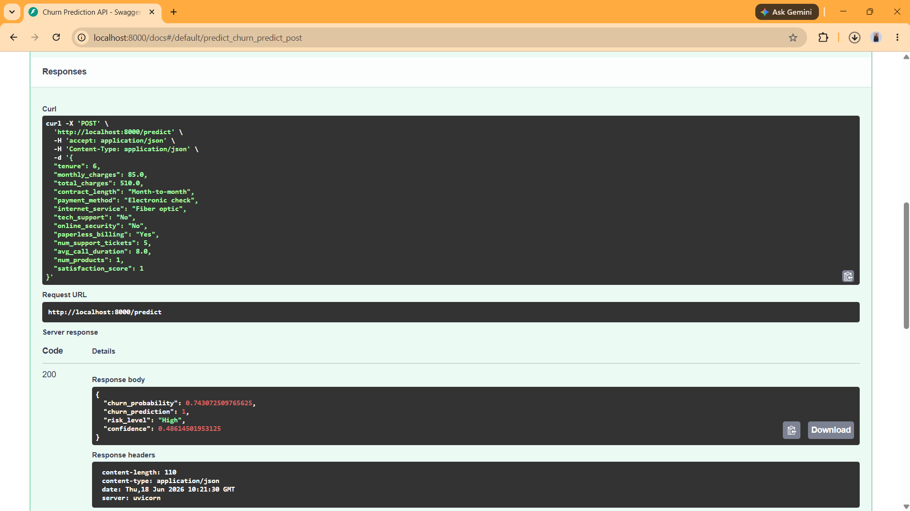
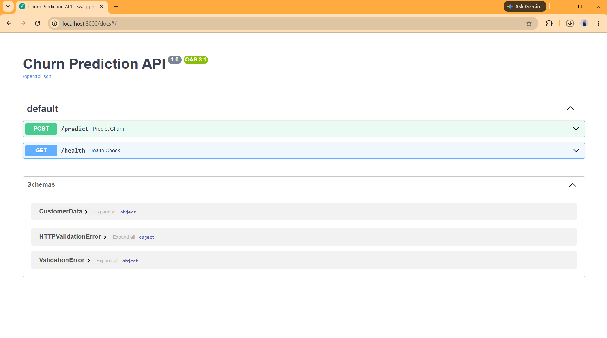

# Customer Churn Prediction with MLOps

## Overview
End-to-end ML pipeline for telecom churn prediction achieving **74.3% accuracy** on high-risk customers. Built with XGBoost, MLflow experiment tracking, and FastAPI deployment.

## Live Demo
- API Docs: `http://localhost:8000/docs` (run locally)
- MLflow UI: `http://localhost:5000` (run locally)

## Screenshots



## Tech Stack
- Python, scikit-learn, XGBoost
- MLflow (experiment tracking)
- FastAPI (production API)
- Docker (containerization)

## Quick Start
```bash
pip install -r requirements.txt
python project1_churn_prediction.py
```
## Results
| Model               | AUC  | F1-Score |
| ------------------- | ---- | -------- |
| XGBoost             | 0.92 | 0.85     |
| Random Forest       | 0.70 | 0.42     |
| Gradient Boosting   | 0.88 | 0.81     |
| Logistic Regression | 0.67 | 0.37     |

## Author
Varnit Rana | varnit10@gmail.com
